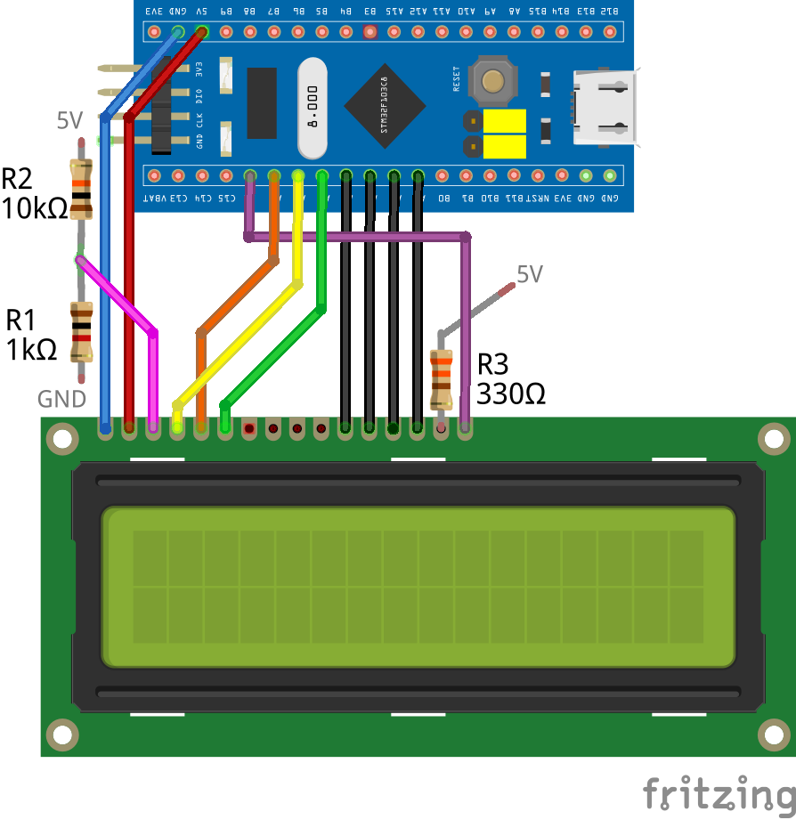
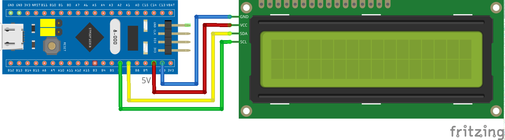

## MecrispForth words for LCDs with HD44780 controller

Driver are tested with LCD1602 and LCD2004, with direct 4bit access or via i2c with PCF8574.
Other single controler modules like LCD1604 will work too. LCD modules with two controler are currently not implemented.

Electrical connections and usage is the same for all modules, but display and memory organization is different. see below

# LCD_direct.fs
Forth words for 4bit parallel connection to a LCD.

* simple Example
<pre>
    : demo
        1 LCD_init drop \ to get rid of start msg
        LCD_on \ switch backlight on
        s" Hello world!" LCD_write
        0 1 LCD_pos \ second line
        s" ============" LCD_write
    ;
</pre>

(sorry no time for real schematic)

# LCD_i2c.fs
forth words for i2c connected LCD1602 (via PCF8574)

* usage is same as above
* uses i2c driver from JCW (link see below)
* i2c addr easily adjustable in source 
* start i2c with ***i2c-init*** before using this library

(sorry no time for real schematic)

# monster.fs
demo with pixelwise moving a "10x8 sprite" over the screen (symetrie complication is just there for fun)

* works with direct and i2c connection

****

This was written on an STM32f103, but should run at least on any STM32 microcontroller.

This is written and tested for Mecrips-Stellaris Forth: http://mecrisp.sourceforge.net/

I used Jean-Claude Wippler's flib to simplify the hardware access. https://git.jeelabs.org/jcw/embello/src/branch/master/explore/1608-forth/flib/

## memory and display organization

characters will be writen with LCD_send or LCD_write on display continuously in order of memory cells. 

LCD_pos takes care of real position.

### LCD 1602

16 col and 2 rows

col-> |  0  |  1  |  2  |  3  |  4  |  5  |  6  |  7  |  8  |  9  | 10  | 11  | 12  | 13  | 14  | 15  |
------|:---:|:---:|:---:|:---:|:---:|:---:|:---:|:---:|:---:|:---:|:---:|:---:|:---:|:---:|:---:|:---:|
row 0 | $00 | $01 | $02 | $03 | $04 | $05 | $06 | $07 | $08 | $09 | $0a | $0b | $0c | $0d | $0e | $0f |
row 1 | $40 | $41 | $42 | $43 | $44 | $45 | $46 | $47 | $48 | $49 | $4a | $4b | $4c | $4d | $4e | $4f |

### LCD 1604

16 col and 4 rows

col-> |  0  |  1  |  2  |  3  |  4  |  5  |  6  |  7  |  8  |  9  | 10  | 11  | 12  | 13  | 14  | 15  |
------|:---:|:---:|:---:|:---:|:---:|:---:|:---:|:---:|:---:|:---:|:---:|:---:|:---:|:---:|:---:|:---:|
row 0 | $00 | $01 | $02 | $03 | $04 | $05 | $06 | $07 | $08 | $09 | $0a | $0b | $0c | $0d | $0e | $0f |
row 1 | $40 | $41 | $42 | $43 | $44 | $45 | $46 | $47 | $48 | $49 | $4a | $4b | $4c | $4d | $4e | $4f |
row 2 | $10 | $11 | $12 | $13 | $14 | $15 | $16 | $17 | $18 | $19 | $1a | $1b | $1c | $1d | $1e | $1f |
row 3 | $50 | $51 | $52 | $53 | $54 | $55 | $56 | $57 | $58 | $59 | $5a | $5b | $5c | $5d | $5e | $5f |

### LCD 2004

20 col and 4 rows

col-> |  0  |  1  |  2  |  3  |  4  |  5  |  6  |  7  |  8  |  9  | 10  | 11  | 12  | 13  | 14  | 15  | 16  | 17  | 18  | 19  |
------|:---:|:---:|:---:|:---:|:---:|:---:|:---:|:---:|:---:|:---:|:---:|:---:|:---:|:---:|:---:|:---:|:---:|:---:|:---:|:---:|
row 0 | $00 | $01 | $02 | $03 | $04 | $05 | $06 | $07 | $08 | $09 | $0a | $0b | $0c | $0d | $0e | $0f | $10 | $11 | $12 | $13 |
row 1 | $40 | $41 | $42 | $43 | $44 | $45 | $46 | $47 | $48 | $49 | $4a | $4b | $4c | $4d | $4e | $4f | $50 | $51 | $52 | $53 |
row 2 | $14 | $15 | $16 | $17 | $18 | $19 | $1a | $1b | $1c | $1d | $1e | $1f | $20 | $21 | $22 | $23 | $24 | $25 | $26 | $27 |
row 3 | $54 | $55 | $56 | $57 | $58 | $59 | $5a | $5b | $5c | $5d | $5e | $5f | $60 | $61 | $62 | $63 | $64 | $65 | $66 | $67 |

